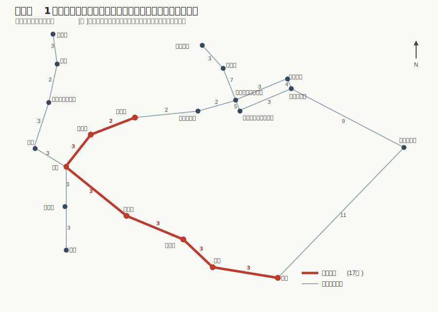

# ダイクストラ法を用いた交通ネットワークの最短経路探索

### 2026.06.08

### 25140041 折下陽春

## 概要
本プログラムは、交通ネットワークのデータを受け取り、指定した始点から終点までの最短所要時間と経路を出力する C++ プログラムです。
標準入力から頂点（駅）と辺（駅間の接続と所要時間）のデータを受け取り、重み付き無向グラフを構築した上で、ダイクストラ法（Dijkstra's Algorithm）を用いて最短経路を算出します。
ダイクストラ法は、重み付きグラフ上で最短経路を求める代表的なアルゴリズムとして広く知られており（矢沢・日経ソフトウエア編, 2022）、交通ネットワークの経路探索にも応用できます。本プログラムではこれを用いて、所要時間が最も短い経路を自動的に導き出します。

## 題材選定の理由
普段利用している「乗換案内アプリ」の裏側で、どのように最適なルートが瞬時に計算されているのか、その仕組みに以前から強い興味を持っていました。
ちょうど他の専門科目（データ構造とアルゴリズム等）において、「優先度付きキュー」の概念や「グラフ探索アルゴリズム」について学んだところだったため、その理論的な知識を実際のシステムに応用・実践するのにこれ以上ない題材だと考え、本テーマを選定しました。

## 使用したライブラリ
本プログラムでは、以下のC++標準ライブラリを使用しています。

- `<iostream>`: 標準入出力（`cin`、`cout`）を使用し、グラフデータの読み込みおよび計算結果の表示を行うため。
- `<vector>`: 動的配列を使用し、隣接リスト形式でのグラフ構築（`graph`）、各駅への最短所要時間の保持（`dist`）、および経路復元用の直前の駅の記録（`prev`）を管理するため。
- `<map>`: 連想配列（`std::map`）を使用し、入力される文字列の駅名を、内部処理用の整数IDへ動的かつ一意に変換・管理するため。
- `<queue>`: 優先度付きキュー（`std::priority_queue`）を使用し、ダイクストラ法の探索において「現在最も所要時間が短い駅」を効率的に取り出すため。
- `<string>`: 駅名や入力行など、文字列データを保持および操作するため。
- `<sstream>`: 文字列ストリーム（`std::istringstream`）を使用し、1行に含まれる隣接駅のデータ数が可変である入力テキストを、空白区切りで安全に分割・解析するため。
- `<algorithm>`: アルゴリズム（`std::reverse`）を使用し、終点から始点へ逆順に格納した経路の配列を、出力用に正しい順序へ並べ直すため。

## プログラムの構造と処理の流れ
本プログラム（`main.cpp`）は、大きく分けて以下の処理から構成されています。

### 1. `node_id` 関数（頂点の動的割り当て）
駅名（文字列）を内部で扱う整数 ID（0,1,2,...）に変換します。
`std::map` を使い、初めて登場した駅には自動で新しい ID を割り振ります。
これにより、事前に頂点数を定義する必要がなくなっています。

### 2. `read_graph` 関数（グラフの構築）
標準入力からグラフデータを 1 行ずつ読み取ります。
「駅名 隣接駅 時間」のデータを `std::istringstream` で解析し、無向グラフとして双方向に辺を張ります（隣接リスト形式）。

### 3. `dijkstra` 関数（探索処理）
アルゴリズムの本体です。
`std::priority_queue`（優先度付きキュー）を用い、「現在わかっている範囲で最も近い駅」から順番に探索を広げ、各駅への最短所要時間と「直前の駅（経路復元用）」を記録します。

### 4. `print_path` 関数（経路の復元）
探索終了後、「直前の駅」の配列を終点から始点へ向かってさかのぼり、最後に逆順に並べ直すことで、具体的なルートを出力します。

## 実行と入力方法（リダイレクトの活用）
グラフデータは手作業で入力するのは非効率的なため、駅の接続データをまとめたテキストファイル（`tama_network.txt` など）を用意し、標準入力へのリダイレクト（`<`）を使って実行します。

### コンパイル

```bash
g++ main.cpp
```

### 実行（リダイレクト使用）

```bash
./a.out < tama_network.txt
```

## 入出力の仕様と例
入力データの 1 行目には「始点 終点」を指定し、2 行目以降に

```text
駅名 隣接駅1 所要時間1 隣接駅2 所要時間2 ...
```

の形式で路線図のデータを記載します。

## 入出力例1（正常:多摩地域のネットワーク）
南大沢から町田への経路探索の例です。
このネットワークの全体像を、各駅の実際の地理的位置の概略に基づいて配置した模式図を `network.svg` に示します。図中の青い点が各駅を表し、駅間を結ぶ灰色の線が辺（接続）を、線に添えた数字が所要時間[分]を表します。本プログラムが算出する最短経路（南大沢から多摩境・橋本・横浜線経由で町田に至る17 分の経路）を、赤い太線で強調して示しています。図の上方向が北に対応しており、八王子が北側、町田や新百合ヶ丘が南東側に位置することが確認できます。



### 入力

```text
Minami-Osawa Machida
Keio-Nagayama Keio-TamaCenter 3 Odakyu-Nagayama 4
Keio-TamaCenter Keio-Horinouchi 2 Matsugaya 7 Odakyu-TamaCenter 5
Keio-Horinouchi Minami-Osawa 2
Minami-Osawa Tamasakai 2
Tamasakai Hashimoto 3
Hashimoto Aihara 3 Sagamihara 3 Minami-Hashimoto 3
Aihara Hachioji-Minamino 3
Hachioji-Minamino Katakura 2
Katakura Hachioji 3
Sagamihara Fuchinobe 3
Fuchinobe Kobuchi 3
Kobuchi Machida 3
Minami-Hashimoto Kamimizo 3
Matsugaya Chuo-Univ 3
Odakyu-TamaCenter Odakyu-Nagayama 3
Odakyu-Nagayama Shin-Yurigaoka 9
Shin-Yurigaoka Machida 11
```

### 出力

```text
fixed: Minami-Osawa (time=0)
fixed: Keio-Horinouchi (time=2)
fixed: Tamasakai (time=2)
fixed: Keio-TamaCenter (time=4)
fixed: Hashimoto (time=5)
fixed: Keio-Nagayama (time=7)
fixed: Aihara (time=8)
fixed: Sagamihara (time=8)
fixed: Minami-Hashimoto (time=8)
fixed: Odakyu-TamaCenter (time=9)
fixed: Odakyu-Nagayama (time=11)
fixed: Matsugaya (time=11)
fixed: Hachioji-Minamino (time=11)
fixed: Fuchinobe (time=11)
fixed: Kamimizo (time=11)
fixed: Katakura (time=13)
fixed: Kobuchi (time=14)
fixed: Chuo-Univ (time=14)
fixed: Hachioji (time=16)
fixed: Machida (time=17)
fixed: Shin-Yurigaoka (time=20)
shortest time: 17 min
path: Minami-Osawa -> Tamasakai -> Hashimoto -> Sagamihara -> Fuchinobe -> Kobuchi -> Machida
```

最短経路が「多摩境・橋本・横浜線経由」で17分であることが計算されています。

## 入出力例2（異常：負の重みエラー）
ダイクストラ法は辺の重みがマイナスだと計算が破綻するため、負の値が入力された場合は事前に検知してエラー終了します。

### 入力

```text
Minami-Osawa Tamasakai
Minami-Osawa Tamasakai -3
```

### 出力

```text
error: invalid travel time: -3
```

## 入出力例3（汎用性の確認：別の地域のデータ）
本プログラムはグラフデータさえ正しければどの地域でも動作します。
例として、新宿から東京への経路を、2通りの行き方を含むデータで計算します。

### 入力

```text
Shinjuku Tokyo
Shinjuku Shibuya 5 Yotsuya 5
Shibuya Shinagawa 12
Shinagawa Tokyo 12
Yotsuya Ochanomizu 5
Ochanomizu Tokyo 4
```

### 出力

```text
fixed: Shinjuku (time=0)
fixed: Shibuya (time=5)
fixed: Yotsuya (time=5)
fixed: Ochanomizu (time=10)
fixed: Tokyo (time=14)
fixed: Shinagawa (time=17)
shortest time: 14 min
path: Shinjuku -> Yotsuya -> Ochanomizu -> Tokyo
```

渋谷・品川を経由する経路（24分）ではなく、四ツ谷・御茶ノ水を経由する経路（14分）が最短として正しく選択されています。

## 計算量解析と実装上の工夫
### 時間計算量

頂点（駅）の数を $V$、辺（路線）の数を $E$ とします。

優先度付きキューを用いたダイクストラ法を実装しているため、

$$
O((V + E)\log V)
$$

となります。

無駄な探索を省き、最小値の取り出しを $O(\log V)$ で行えるため、大規模な路線図でも高速に動作します。

### 空間計算量

グラフを隣接リスト形式で保持し、各頂点の最短距離と直前の駅を配列で管理しているため、

$$
O(V + E)
$$

となり、効率的なメモリ管理を実現しています。

### 実装の工夫

`std::map` を活用し、頂点を「文字列の駅名」で直接扱えるようにした点が最大の工夫です。

これによりデータの追加や変更が容易になり、入力例3のような全く新しい路線データもコードの書き換えなしで処理できます。

## 発展的な考察

現在の実装は「あらかじめ決まった一定の移動時間の最小化」のみを行っていますが、実際の乗換案内アプリに近づけるためには、以下のような発展的要素が考えられます。これらは本プログラムには実装していませんが、現在の手法の限界を踏まえた上での発展方向として整理します。

### 多基準最適化への拡張

本プログラムでは辺の重みを「所要時間」の 1 種類のみとしていますが、実際の経路選択では「時間は短いが運賃が高い」「運賃は安いが乗り換えが多い」といったトレードオフが存在します。これを扱うには、各辺に時間・運賃・乗り換え回数などの複数の重みを持たせ、どれか一方を犠牲にしないと他方を改善できない経路の集合を求める問題へと拡張する必要があると思いました。

### 時刻表への対応（静的グラフから動的グラフへ）

本プログラムは「どの駅間も常に一定の所要時間で移動できる」と仮定しています。しかし実際の鉄道では、列車の発車時刻が決まっているため、ある駅に何時に到着したかによって次に乗れる列車（＝実際の所要時間）が変わり、待ち時間も発生します。これを正確に扱うには、辺の重みを固定値ではなく「出発時刻に依存して変化する関数」として扱う必要があると考えます。本プログラムが扱う静的なグラフと、時刻表という時間軸を持つ現実のネットワークとの間にあるこの技術レベルの差が、私が実際の乗換案内システムを実装する上で最も大きな障壁の一つだと考えられます。

## 生成AIの使用について

本課題の作成にあたり、一部で生成AIを利用しました。

### 使用した生成AI

- Anthropic Claude Sonnet 4.6
- Anthropic Claude Opus 4.8

###プロンプト1
C++でダイクストラ法を実装したいのですが、頂点を0, 1, 2のような単なる数字ではなく、"Shinjuku" や"Tokyo"のような文字列の駅名を直接標準入力から受け取って管理する形にしたいです。どのようなデータ構造を使うのが効率的でしょうか？簡単なコードの例も教えてください。

###出力1
文字列の頂点名を効率的に管理しながらダイクストラ法を実装するには、文字列（駅名）と整数（ID）を相互に変換するデータ構造を組み合わせるのが最も標準的で効率的です。
ダイクストラ法のアルゴリズム内部（配列や優先度付きキューなど）では、やはり 0, 1, 2... という整数のインデックスを使った方がメモリや実行速度の面で圧倒的に有利だからです。
具体的には、以下の標準ライブラリ（データ構造）を使用することをお勧めします。
std::unordered_map<std::string, int> または std::map<std::string, int>
新しく出現した文字列（駅名）に対して、0から順番に整数のIDを割り当てるために使います。これにより、「Shinjuku」と入力されたら「0」を返すような辞書を作ります。
簡単なコードの実装例は以下のようになります。
cpp#include <iostream>
include <vector>
include <string>
include <map>

using namespace std;

// 文字列からIDへの変換マップ
map<string, int> name_to_id;
int current_id = 0;

// 駅名を受け取り、対応するIDを返す関数
int get_node_id(const string& name) {
    // まだ登録されていない駅名の場合、新しいIDを割り当てる
    if (name_to_id.find(name) == name_to_id.end()) {
        name_to_id[name] = current_id;
        current_id++;
    }
    return name_to_id[name];
}

int main() {
    // グラフの本体（隣接リスト）。頂点数は可変なのでvectorで管理
    // vectorのインデックスが「駅のID」になります
    vector<vector<pair<int, int>>> graph(100); // 仮に最大100駅とする

    string u_name, v_name;
    int weight;

    // 例: "Shinjuku Tokyo 15" のような標準入力を受け取る
    while (cin >> u_name >> v_name >> weight) {
        int u = get_node_id(u_name);
        int v = get_node_id(v_name);

        // 無向グラフの辺を追加
        graph[u].push_back({v, weight});
        graph[v].push_back({u, weight});
    }

    // ここで整数ID (u, v) を使ってダイクストラ法を実行できます
    // ...

    return 0;
}
解説
このアプローチの利点は、グラフの構築部分とダイクストラ法のロジック本体を切り離せることです。get_node_id 関数を通すことで、アルゴリズム本体は「単なる整数のグラフ」として扱うことができるため、ダイクストラ法の標準的な実装（std::priority_queue を用いたもの）をそのまま適用できます。

###生成AIの出力に欠けていると思われる情報と補足
AIの提案は有用でしたが、そのままでは「出力時に整数IDから元の駅名（文字列）に戻す」処理が非効率になりがちでした。そこでAIのコードをそのまま使うのではなく、自分自身の工夫としてstd::vectorstd::string names という配列を別で用意し、ID（インデックス）から即座に駅名を取り出せるようにデータ構造を改善しました。

###プロンプト2
std::cin で標準入力から値を読み取る際、「A駅 隣接駅1 所要時間1 隣接駅2 所要時間2...」のように、1行の中にいくつのデータが入っているか（隣接駅がいくつあるか）事前には分からない場合、どのようにC++で読み込めばよいですか？

###出力2
標準入力から1行の中に含まれるデータ数が可変の場合、std::cin >> だけを使って読み込もうとすると、どこで次の行に移ったのかを判定するのが難しくなります。
このようなケースでは、「行単位の読み込み」と「文字列ストリーム（std::istringstream）」を組み合わせるのがC++における定石です。
具体的には <sstream> ヘッダをインクルードし、以下の手順で処理を行います。
std::getline を使って、標準入力から1行を丸ごと std::string 型の変数に読み込む。
読み込んだ文字列から std::istringstream オブジェクトを作成する。
作成したストリームから、通常の cin と同じように空白区切りでデータを順番に取り出す。
以下に具体的なコード例を示します。
cpp#include <iostream>
include <string>
include <sstream>

using namespace std;

int main() {
    string line;

    // 1行ずつ読み込むループ
    while (getline(cin, line)) {
        // 空行の場合はスキップ
        if (line.empty()) continue;

        // 読み込んだ1行の文字列をストリームに変換
        istringstream iss(line);

        string base_station;
        // まず先頭の「A駅」を読み込む
        if (!(iss >> base_station)) {
            continue; // 行が空白のみだった場合などのフェイルセーフ
        }

        cout << "基準駅: " << base_station << endl;

        string neighbor_station;
        int time;

        // 残りのデータを「隣接駅」「所要時間」のペアとして読み込めるだけ読み込む
        while (iss >> neighbor_station >> time) {
            cout << "  -> 隣接: " << neighbor_station << ", 時間: " << time << endl;

            // ここでグラフに辺を追加する処理を行う
            // 例: graph[base_id].push_back({neighbor_id, time});
        }
    }

    return 0;
}
解説
while (iss >> neighbor_station >> time) の部分は、ストリームから文字列（駅名）と整数（時間）の2つをセットで読み込めた場合にのみtrueとなります。行の末尾に到達し、これ以上読み取れるデータがなくなると自動的にループを抜けるため、隣接駅が1つでも、5つでも、あるいは0個であっても安全に処理することができます。

###生成AIの出力に欠けていると思われる情報と補足
AIが生成したコードは、与えられた文字列の読み込み処理としては問題なく動作しましたが、交通網データにあり得る「入力のミス（負の時間）」に対する例外処理が考慮されていませんでした。そのままダイクストラ法に渡すと不具合を起こす可能性があったため、筆者自身で if (w < 0) によるバリデーションと、エラー出力後に exit(1) で強制終了する安全装置のロジックを追加して実装しました。

###プロンプト3
グラフの隣接リストを構築する際、vector<vector<pair<int, int>>> graph(100); のように頂点数を100で固定してしまっています。しかし、駅名は std::map で動的にID変換（0, 1, 2...）しているため、入力データに101個以上の駅が含まれていると、配列の範囲外アクセス（セグメンテーションフォールト）が起きてクラッシュしてしまいます。これを防ぐために、新しい駅が入力されるたびに graph のサイズを動的に拡張し、頂点数の制限をなくすにはどのように修正すればよいですか？

###出力3
頂点数（駅の数）が事前にわからない場合、std::vector の resize メソッドを使用して、必要になったタイミングで動的に配列のサイズを拡張するのが最も適したアプローチです。
現在の実装では node_id 関数によって新しい駅が登場するたびに新しいID（インデックス）が発行されます。そのため、辺を追加する直前に、取得したID（u または v）が現在の graph のサイズを超過しそうであれば、そのIDが収まるサイズまで配列を広げる処理を追加します。
具体的には、read_graph 関数の実装を以下のように修正します。
cpp// 最初は空のグラフ（サイズ0）として宣言する
vector<vector<pair<int, int>>> graph;

string line;
while (getline(cin, line)) {
    istringstream iss(line);
    string station;
    if (!(iss >> station)) continue;

    int u = node_id(station);
    string neighbor;
    int w;

    while (iss >> neighbor >> w) {
        // (負の重みのエラー処理は省略)

        int v = node_id(neighbor);

        // u と v のうち、より大きい方のIDを取得
        int max_id = max(u, v);

        // グラフのサイズが足りない場合、max_id が収まるサイズ(max_id + 1)まで拡張する
        if (max_id >= graph.size()) {
            graph.resize(max_id + 1);
        }

        // 辺の追加
        graph[u].push_back({v, w});
        graph[v].push_back({u, w});
    }
}
解説
std::vector::resize は、配列のサイズを拡張する際、すでに格納されている要素（これまでに追加した辺のデータ）をそのまま保持してくれます。この修正により、事前の頂点数制限（100件など）がなくなり、メモリが許す限り大規模な路線図データを安全に読み込めるようになります。

###生成AIの出力に欠けていると思われる情報と補足
AIの回答はおおむね妥当で、std::vector::resize と std::max を組み合わせて動的にメモリを確保する手法は実用的でした。AIの出力コードでは負の重みに対するバリデーション処理が省略されていましたが、実際のプログラムへの統合にあたっては、自作した if (w < 0) のエラー検知ロジックとこの動的拡張処理を組み合わせ、安全性を確保した上で実装しました。この修正により、本プログラムの「事前に頂点数を定義する必要がない」という仕様が、コード上でも完全に実現されました。

## 参考文献

1. 浅野哲夫・岩野和生・梅尾博司 訳 (2023). 『世界標準MIT教科書 アルゴリズムイントロダクション 第4版 第1巻 基礎・ソートと順序統計量・データ構造・数学的基礎』. 近代科学社.
2. 矢沢久雄・日経ソフトウエア編 (2022). 『身近な疑問を解いて身につける 必修アルゴリズム』. 日経BP.
3. cpprefjp - C++日本語リファレンス. 「map - C++ Reference」. <https://cpprefjp.github.io/reference/map/map.html>
